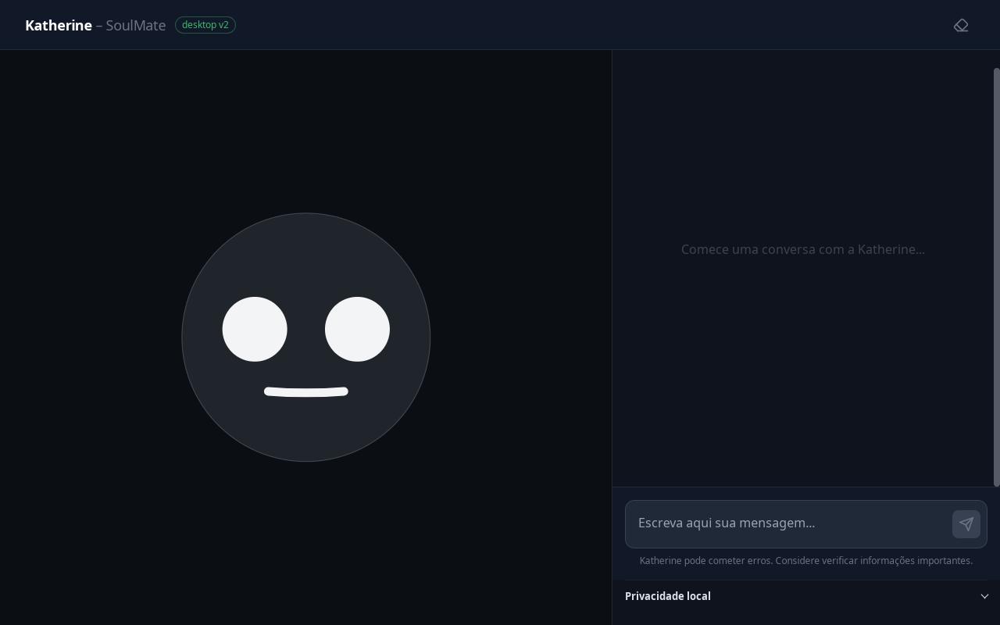
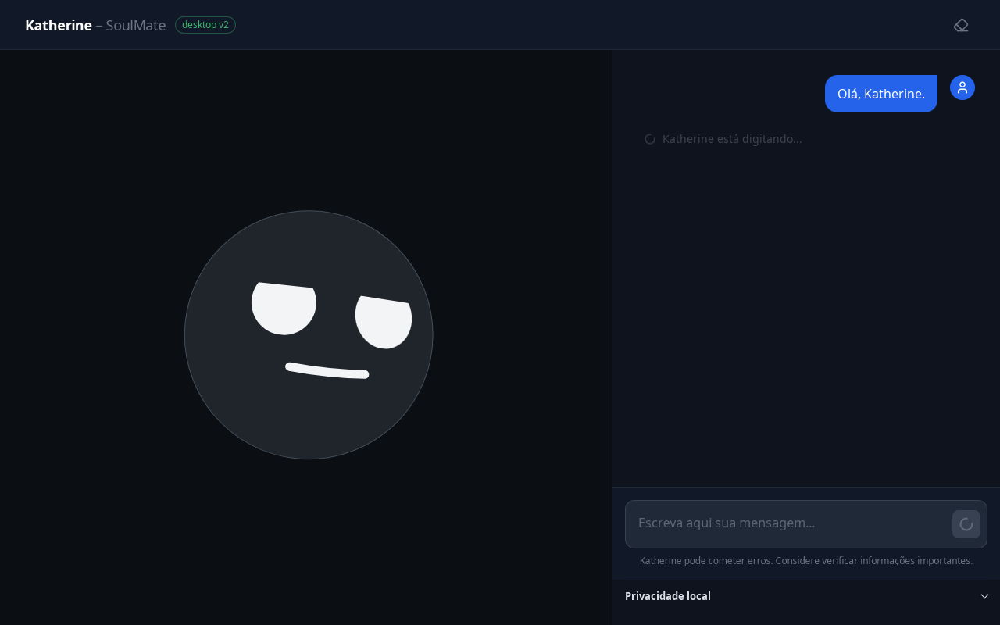
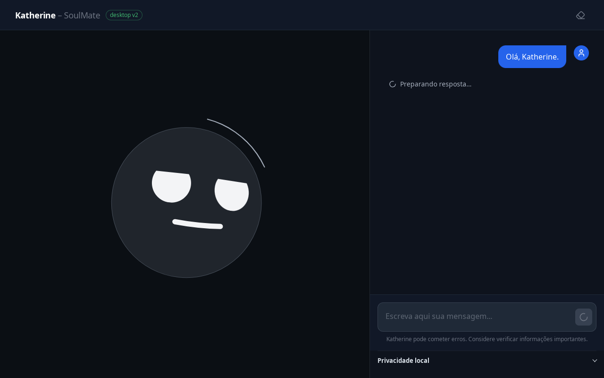
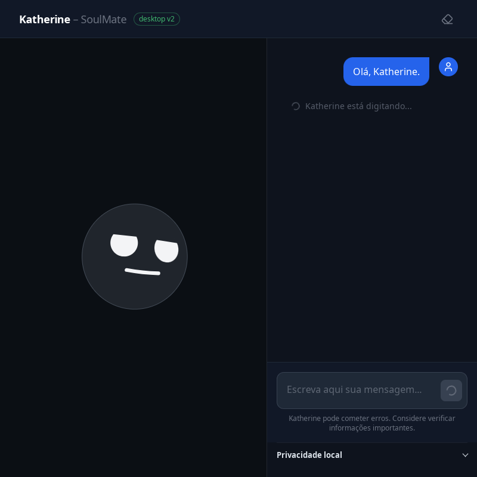
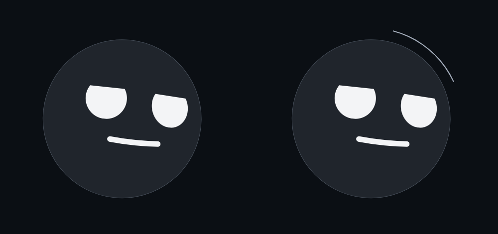
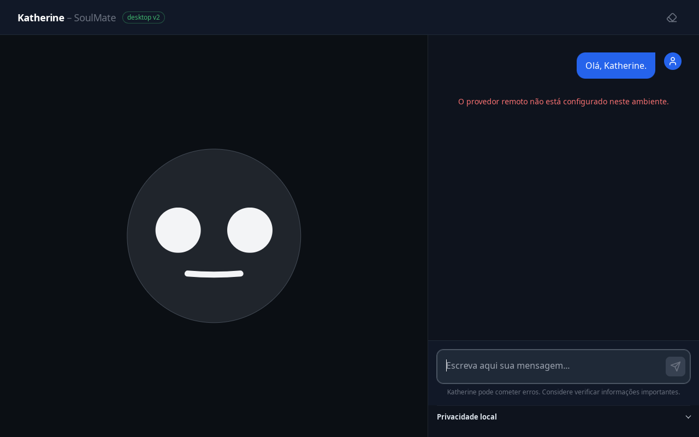

# Katherine presence V2: revisão implementada

## Origem e escopo

Tarefa autorizada pelo mantenedor em 2026-09-09: implementar a proposta discutida e abrir uma PR com prints comparativos para avaliação. Base: `3431ed7` (`origin/main` no início da tarefa). Não depende de outra PR.

Esta é a primeira etapa mínima, não a implementação de todos os estados conceituais. Mantém o rosto bfce original, inclusive boca, proporções, expressão e mapper existentes. Acrescenta um único arco curto enquanto `isLoading === true`, sem progresso inventado. Idle não ganha decoração. Não há nós, redes ou relações fictícias.

O arco está fora do disco existente, sem redimensioná-lo. A reserva usa o espaço livre da região de presença atual. Portanto, esta etapa não implementa nem promete uma janela flutuante compacta, ainda inexistente neste fluxo. Em uma futura integração compacta será necessário reservar a extensão de 8% por lado.

## Comparação visual

Capturas nativas do build real `desktop.html`, em pywebview/WebKitGTK, Xvfb, escala 100%, 1280×800 e 800×800. Nenhuma imagem é concept art. Antes: build de `3431ed7`. Depois: código desta PR. Conteúdo isolado, sem conversas ou dados pessoais.

### Idle: preservar é intencional

| Antes | Depois |
| --- | --- |
|  |  |

As duas capturas de idle com runtime sem provedor são **idênticas pixel a pixel**. Não se adicionou halo decorativo nem movimento de repouso.

### Processamento, 1280×800

| Antes | Depois |
| --- | --- |
|  |  |

### Processamento, 800×800

| Antes | Depois |
| --- | --- |
|  |  |

### Detalhe, antes à esquerda e depois à direita



**Importante:** processamento e resposta usam um provider offline de teste explicitamente identificado. Ele pausa a geração para permitir captura e devolve texto fixo. UI, shell, bridge, runtime, renderer e SQLite são reais. Isso não demonstra integração com um modelo remoto nem qualidade de resposta. Nenhuma quota foi consumida. A pequena diferença de rasterização/acomodação da expressão em algumas capturas de processamento impede alegar identidade pixel a pixel nesse estado. O vendor e a geometria não foram alterados, e as dimensões/posições medidas permaneceram iguais.

### Erro real, sem provedor configurado



O envio pelo textarea/botão reais retornou “O provedor remoto não está configurado neste ambiente.” O campo voltou a ser habilitado e o arco desapareceu. Não há rosto triste nem atividade inventada para representar erro.

## Decisões

- Arco de 50 graus, raio 54 na geometria cujo disco tem raio 46. Neutro `#a7b0be`, sem glow, filtros ou rotação.
- Contraste calculado do arco sobre a superfície de presença `#0b0f14`: **8,78:1**. Isso não é uma garantia sobre wallpapers arbitrários.
- Stroke óptico de 1,5 a 2,5 px, guiado pelo tamanho do container. Oculto abaixo de 48 px.
- Entrada/saída por opacidade em 140 ms. Preferência nativa de movimento reduzido elimina a transição.
- Loading continua efêmero. Não altera emoção, memória, relacionamento, identidade ou persistência.
- O arco é decorativo, não focável, sem eventos de ponteiro e sem semântica falsa de progressbar.
- Status acessível no desktop: “Preparando resposta…”. A cópia padrão do chat web permanece intacta.
- Spinners e pulse existentes ficam estáticos apenas dentro do companion desktop. O status usa o cinza legível da superfície.
- Sem pacote novo, requests, timers ou scheduler adicionados à produção.

## Evidência e rastreabilidade

| Requisito | Check concreto | Resultado observado |
| --- | --- | --- |
| Preservar rosto e identidade visual existente | Testes com renderer SVG real preservam referências do disco e olhos durante mudanças de loading. Comparação nativa de idle | Dois olhos, mesmo disco. Idle integralmente idêntico pixel a pixel |
| Sinal somente durante atividade confirmada | `KatherinePresence.test.jsx`, incluindo valores não booleanos, rerender e duas instâncias | Nove testes passaram. Só `true` ativa busy, término volta a idle, isolamento preservado |
| Sem loops permanentes | `document.getAnimations()` no desktop após acomodação | Antes: 3 animações CSS durante espera. Depois: 0. Idle: 0 em ambos |
| Face parada após transição | MutationObserver sobre renderer real por 1 segundo durante espera estabilizada | Zero mutações. Não é benchmark completo de CPU/energia |
| Escala óptica | Redimensionamento controlado da instância real para 32/48/64/96/128/256 px | Arco oculto em 32, visível a partir de 48. Dois olhos em todas as escalas. Não é teste de usabilidade em modo flutuante |
| Movimento reduzido | Preferência GTK real `gtk-enable-animations=false` | `matchMedia` confirmou reduce e duração computada foi `0s` |
| Status honesto e acessível | Testes de CompanionLayout e AppDesktop, mais consulta à UI GTK durante espera | `role=status` contém “Preparando resposta…” |
| Erro e recuperação do campo | Envio real sem provedor configurado, sem substituir runtime | Erro sanitizado visível, input habilitado, `activity=idle`, opacidade do arco 0 |
| Fluxo de resposta | Envio por textarea/botão, provider offline de teste | Resposta apareceu, arco voltou a 0, estado persistido pelo runtime real |
| Layout desktop preservado | Medidas DOM em 1280 e 800 px, idle/espera/resposta/erro | Mesmos retângulos da face, composer visível, sem overflow horizontal |
| Bridge, persistência, privacidade, navegação | 96 testes backend desktop e smoke oficial | Todos passaram, smoke retornou `SMOKE_OK` |
| Web e demais regressões | Suíte completa frontend e default de `loadingLabel` preservado | 159 testes Node + 114 testes de componentes passaram |
| Build e qualidade | Build Vite, ESLint, `git diff --check`, detector visual focado, `uv lock --check` | Passaram. Detector retornou `[]`. Lock inalterado |
| Prints comparativos | PNGs nesta pasta e inspeção visual nativa | Comparativos completos e recorte publicados com as limitações acima |

Observações brutas: [antes real](before-real.json), [antes controlado](before-scripted.json), [depois real](after-real.json), [depois verificado](after-verified.json), [movimento reduzido](after-reduced.json), [comparação de pixels](pixel-comparison.json).

A suíte completa emite avisos React `act(...)` em testes existentes de chat/privacidade. Os testes novos focados não emitiram esses avisos. Não foram feitas refatorações paralelas para removê-los.

## Reproduzir

Pré-requisitos: ambiente `uv` do backend, dependências frontend instaladas, Xvfb e bibliotecas GTK/WebKitGTK do sistema. Nenhuma mudança em dependências é necessária. Neste host, o Python 3.12 do uv usa os bindings GTK já instalados no sistema, acrescentados **ao final** de `sys.path` para não sobrescrever `typing_extensions` do lock.

```bash
npm --prefix frontend run build
npm --prefix frontend test
npm --prefix frontend run lint
uv lock --project backend --check
uv run --project backend python -m pytest \
  backend/tests/test_desktop_api.py \
  backend/tests/test_desktop_app_runtime.py \
  backend/tests/test_desktop_build_resolver.py \
  backend/tests/test_desktop_import_isolation.py \
  backend/tests/test_desktop_navigation.py \
  backend/tests/test_desktop_security.py -q
```

Captura/aceitação do V2 no entry real. Use diretório novo a cada execução, fora do repositório:

```bash
xvfb-run -a -s '-screen 0 1440x1000x24' \
  uv run --project backend python -c "
import sys, runpy
sys.path.append('/usr/lib/python3/dist-packages')
sys.argv = ['presence_review.py', '--scripted', '--verify-v2',
            '--output', '/CAMINHO/ABSOLUTO/NOVO/presence-review']
runpy.run_path('scripts/presence_review.py', run_name='__main__')
"
```

- Remova `--scripted` para testar o erro real sem provedor configurado.
- Adicione `--reduced-motion` para testar a preferência nativa GTK.
- Para comparar outro baseline, use o mesmo runner externo com o build baseline e sem `--verify-v2`. O runner não modifica a aplicação, exceto a largura inline temporária nos probes ópticos opcionais do V2.
- O script usa SQLite isolado dentro de `--output` e se recusa a reutilizar um banco existente. Não publique esse banco.

Smoke oficial:

```bash
xvfb-run -a -s '-screen 0 1280x800x24' \
  uv run --project backend python -c "
import sys, runpy
sys.path.append('/usr/lib/python3/dist-packages')
runpy.run_path('scripts/desktop_smoke.py', run_name='__main__')
"
```

O smoke oficial usa `desktop-smoke.html` e provider offline. Ele complementa, não substitui, as capturas/asserções no entry de produção `desktop.html`.

## Riscos, migração e rollback

Sem alteração de schema, armazenamento, autorização ou API backend. Reverter o commit restaura a apresentação anterior. O novo prop opcional de `MessageList` preserva o default web.

CSS container queries e unidades cqi foram observadas funcionando no WebKitGTK deste host. Não se alega suporte validado em versões antigas ou em outros compositores. A presença externa exige respiro no container. A composição desktop atual oferece esse espaço.

## Deliberadamente fora de escopo

- Janela flutuante real, voz/listening, sucesso/bloqueio como novas máquinas de estado.
- Conexões contextuais sem entidades reais disponíveis.
- Remoção da boca existente ou mudança do vendor/emotion mapper.
- Teste com provedor remoto pago, testes humanos de reconhecimento/distração, horas de uso.
- Medição energética, perfil abrangente de CPU/RAM, Wayland, fundos arbitrários e escalas fracionárias.
- Construção/instalação de novo `.deb`. Resolução do build e limites do shell foram testados, mas isso não equivale a instalar o pacote.

A melhoria comprovada é técnica e restrita: sinal de atividade estático, status mais fiel, loops eliminados no companion e repouso preservado. A preferência estética e a compreensão do arco ainda precisam da avaliação do mantenedor e de uso real.
